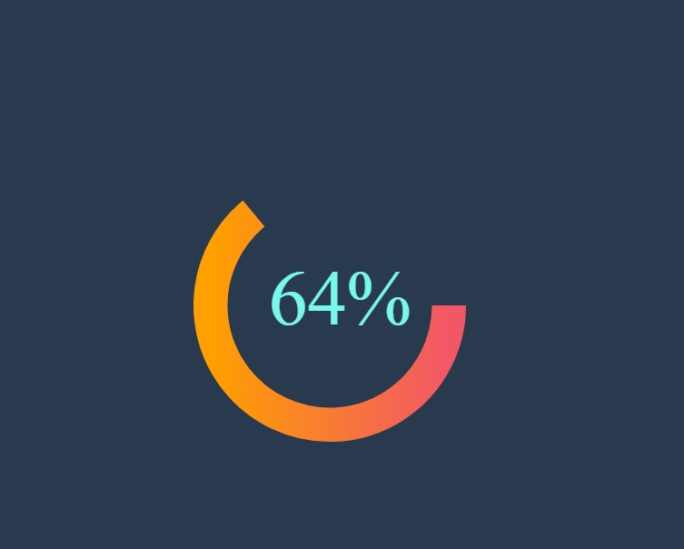

---

# 📊 Curved Progress Bar  

A **dynamic curved progress bar** built using **HTML**, **CSS**, and **JavaScript**. This component visually represents progress in a unique curved format with a customizable gradient design.

---

## 🚀 Features  

- Smooth and **animated progress** visualization.  
- Fully **customizable size, value, and gradient colors**.  
- Displays percentage values directly on the chart.  
- Responsive design for easy integration in web projects.

---

## 📸 Screenshot  

  

---

## 🛠️ Tech Stack  

- **HTML**: Markup structure for the progress bar.  
- **CSS**: Styling for layout and design.  
- **JavaScript**: Core logic for animations and progress handling.  

---

## 🌐 Live Demo  

[Live Demo](https://github.com/muaz64/Curved-Progress-Bar.git)  

---

## ⚙️ Installation  

Follow these steps to use the Curved Progress Bar in your project:  

1. Clone the repository:  
   ```bash
   git clone https://github.com/muaz64/Curved-Progress-Bar.git
   cd Curved-Progress-Bar
   ```  

2. Open the `index.html` file in your browser:  
   ```bash
   open index.html
   ```  

---

## 🧩 Project Structure  

```plaintext
curved-progress-bar/
│
├── index.html       # HTML structure  
├── style.css        # CSS styling  
├── script.js        # JavaScript logic  
├── README.md        # Project documentation  
└── Screenshot.png   # Screenshot of the progress bar  
```

---

## 🎨 Customization  

You can customize the progress bar by modifying the following attributes:  

### HTML Attributes in `.container`  
- **`data-size`**: Defines the size of the progress bar (default: `300`).  
- **`data-value`**: Sets the initial progress value (default: `64`).  
- **`data-arrow`**: Direction of the progress bar arrow (`up` or `down`).  

Example:  
```html
<div class="container chart" data-size="400" data-value="80" data-arrow="up"></div>
```

---

## 🧘 How It Works  

1. The progress bar is generated dynamically using the **Dial class** in `script.js`.  
2. It uses **SVG paths** to draw the curved progress bar with gradient colors.  
3. The progress is animated using JavaScript for a smooth user experience.

---
 

## 📝 License  

This project is **open-source** and free to use under the [MIT License](LICENSE).  

